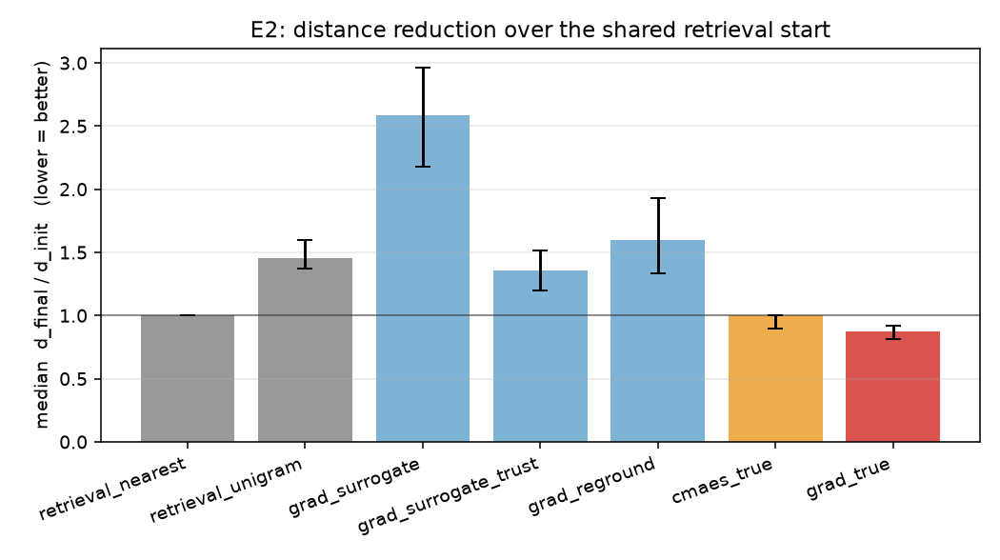
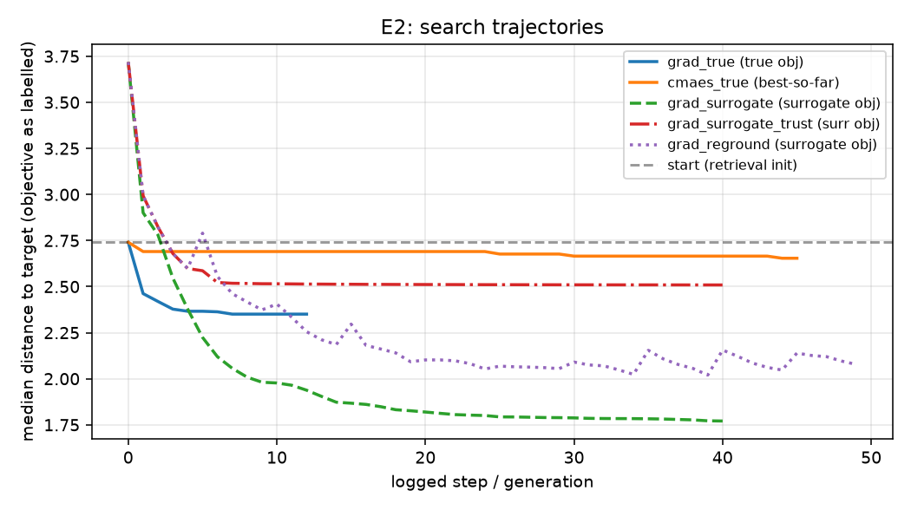

# timbreprobe — 音色能不能被测量、能不能被导航？

[English README](README.md) · **行动指南：** [ROADMAP.md](ROADMAP.md)

这个仓库是一个更大的研究计划——**合成器 Patch 逆向生成**（从人类意图到结构化合成器参数，而不是直接生成波形）——的**前置 gate 实验**。在投入整套系统之前，有两个假设必须先成立，Stage 0 就是来检验它们的：

* **H1 感知单调性**：两个音色之间的嵌入距离，能不能预测人会觉得哪一个更像？*（由 E1 听音实验测量；材料由本仓库生成，需要真人被试）*
* **H2 可导航性**：能不能把嵌入距离当作目标函数，用搜索算法把参数优化到目标音色上？如果能，学出来的**代理模型**够不够快、够不够准，以至于不需要真的渲染？*（由 E2 实验测量，全自动）*

整套东西建立在一个**可微减法合成器**（31 维参数，STFT 域滤波）之上，其输出喂给一个 **85 维可微 DSP 嵌入**。于是"参数 → 音频 → 嵌入"是同一张可微计算图，"真梯度"导航因此可以作为 oracle 基线。

**冒烟规模的主结论（3900 语料 / 48 目标）**：H2 只是**弱通过**。真梯度搜索确实优于检索起点（距离比中位 **0.845**，95% CI [0.765, 0.938]），但很快进平台、且要消耗约 5900 次真实渲染；而三种代理搜索**全部差于起点**（1.44–2.12），代理的分布外秩相关只有 τ≈0.39——**瓶颈是代理，不是搜索算法**。见[结果](#结果)。

---

## 这是什么（以及不是什么）

* 它**是**一套可复现、能在 CPU 上跑的实验仪器：用来测量某个音色嵌入是否 (a) 与人类相似性判断单调一致、(b) 能作为优化目标。E2 全自动，E1 材料一条命令生成、浏览器直接测。
* 它**不是** Patch 生成器、不是合成器插件、也不是感知模型。内置嵌入是手工 DSP 特征——这是刻意的**下限锚**：一个预训练嵌入（CLAP / MuQ）如果在人类相似性上打不过它，就不值得用。替换嵌入只需改一个模块（`timbreprobe/features.py`）。
* 合成器是 Stage 0 的 **oracle**，不是产品：滤波在 STFT 域完成（没有滤波相位/振铃），渲染协议是固定的 C4 持续音。见[已知局限](#已知局限)。

## 快速开始

```bash
git clone https://github.com/Fengrru/timbreprobe && cd <REPO>
pip install -r requirements.txt        # 或 pip install -e ".[report]"

python -m timbreprobe.cli sanity                  # 正确性检查（约 1 分钟，不需要数据）
python -m timbreprobe.cli corpus --preset smoke   # 建语料 + 嵌入（约 2-3 分钟）
python -m timbreprobe.cli e2     --preset smoke   # 跑 E2
python -m timbreprobe.cli plot   --run out/e2_smoke

python -m timbreprobe.cli e1     --preset smoke   # 生成听音测试材料
python -m timbreprobe.cli e1-analyze --responses res_P01.json,res_P02.json
```

`--preset full` 是论文规模（6200 语料、128 目标、120 步优化）。产物都落在 `out/`（已 git-ignore）：语料、嵌入、代理、结果 JSON、曲线、图。冒烟实验结果已提交在 [`results/smoke/`](results/smoke/)。

想先听一下这个参数空间： [`assets/demo/`](assets/demo/) 里有 16 个锚点 patch 的 0.5 秒 wav。

> **线程注意**：在开发机（4 核 Windows、纯 CPU）上，多线程 torch 在这些张量形状下比单线程**慢 2–5 倍**。CLI 因此默认 `torch.set_num_threads(1)`；如果你的机器正常，用 `STAGE0_THREADS` 覆盖。B=64 的渲染开销：前向约 2.3 秒、含反向约 7.1 秒（单线程）。

---

## 结果

### E3 — 代理保真度（patch → 嵌入 回归）

| 划分 | n | R² | 余弦 | 距离 Pearson | 距离 Kendall τ |
|---|---|---|---|---|---|
| val | 308 | 0.780 | 0.884 | 0.893 | **0.701** |
| test | 1119 | 0.510 | 0.719 | 0.725 | 0.482 |
| 留出锚点 | 811 | 0.288 | 0.673 | 0.529 | **0.387** |

"留出锚点"来自四个被刻意排除在训练之外的锚点簇。对搜索而言真正重要的是**距离的秩相关**（τ），而它一旦出分布就明显退化。

### E2 — 可导航性（48 目标，其中一半来自留出锚点簇）

所有方法对每个目标都从**同一个起点**出发：训练集中嵌入最近邻（也就是 Stage 1 的检索初始化）。因此下表每个数字都是**在检索之上额外获得的价值**。`ratio = d_final / d_init`（中位数，bootstrap 95% CI）；`renders` = 消耗的真实渲染次数。

| 方法 | ratio | 分布内 | 留出 | success@0.5 | renders |
|---|---|---|---|---|---|
| `retrieval_nearest`（= 起点） | 1.000 | 1.000 | 1.000 | 0.06 | 0 |
| `retrieval_unigram64`（随机抽 64 个预设取最优） | 1.393 | 1.646 | 1.341 | 0.00 | 0 |
| `grad_surrogate` | 2.119 | 2.633 | 1.900 | 0.02 | 48 |
| `grad_surrogate_trust`（信任域） | 1.443 | 1.614 | 1.353 | 0.00 | 48 |
| `grad_reground`（重锚定 + 在线微调） | 1.690 | 2.077 | 1.478 | 0.00 | 576 |
| **`grad_true`**（oracle 上界） | **0.845** [0.765, 0.938] | 0.797 | 0.875 | **0.15** | 5856 |
| `cmaes_true`（sep-CMA-ES，同一目标函数） | 0.961 [0.899, 1.000] | 0.948 | 0.961 | 0.08 | 21696 |




**四条结论。**

1. **H2 弱通过。** 只有真梯度搜索优于检索起点，且置信区间不跨 1.0——但中位收益约 15%，15% 的目标距离减半，轨迹很快进平台（约 15 步内 3.08 → 2.54 后不再下降）。单调局部搜索无法完成部分目标所需的**离散跳跃**（波形/八度切换）。
2. **在这个空间里，梯度信息的价值远高于种群搜索。** sep-CMA-ES 花了 3.7 倍渲染（21696 vs 5856），结果反而更差（0.961 vs 0.845）。
3. **真正的瓶颈是代理而不是优化器。** 三种代理方案全部**差于起点**。更值得注意的是：它们在**分布内比留出目标更差**（2.63 vs 1.90）——代理在"自信但错误"的地方把优化器带得最偏。在代理保真度提升之前，"在代理上自由搜索"不是可行的 Stage 1 设计。
4. **重锚定单独救不了它。** 每 20 步真实渲染 + 在线微调只把 2.12 拉到 1.69；而不消耗额外渲染的信任域在分布内更好（2.63 → 1.61）。

**对计划的影响**：在迁移到真实合成器（Vital）或哼唱模态之前，先解决二者之一——(a) 换更强的嵌入（CLAP / MuQ，再用 E1 复核单调性）；(b) 换搜索空间（在真实预设上训练自编码器，在**合法潜空间**里搜索，把离散跳跃变成连续路径）。

### E1 — 感知单调性（材料就绪，等人）

`python -m timbreprobe.cli e1` 会生成自包含的 `listening_test.html` + wav 文件 + 单独的答案 key：

* 从语料池取 600 个 patch，以 0.5 秒重新渲染并嵌入——被试听到的音频与计算距离用的音频**严格是同一份**；
* 每题播放参考 A 与两个选项，两选项与 A 的嵌入距离落在池内距离分布的**不同分位区间**（冒烟池实测边界 7.18 / 10.26 / 14.05）；
* 更近的那个选项在屏幕上的位置随机；页面内**不含答案**；作答结果下载为 JSON；`e1-analyze` 按距离对比强度分层给出一致率与 Wilson 区间。

预注册门槛：主嵌入需总体显著高于随机水平，**且**随对比强度单调上升；预训练嵌入若打不过手工特征基线则不予采用。

---

## 系统组成

```
patch u ∈ [0,1]^31
   │  synth.py        可微减法合成器（振荡器 → 驱动 → 滤波 → VCA → 驱动）
   ▼
音频 [B, T]
   │  features.py     85 维可微 DSP 嵌入（log-mel、质心、带宽、软滚降、平坦度、通量、
   ▼                   斜率、波峰因子、高低频带比、包络统计、平滑过零率、谐波/奇偶比）
嵌入 z
   ├─ surrogate.py    MLP u → z（加速器；E3 度量它）
   └─ navigators.py   真梯度 / 代理 / 重锚定 / sep-CMA-ES / 检索
```

| 模块 | 作用 |
|---|---|
| `schema.py` | 31 维参数 schema；连续↔归一化映射、离散维软混合、硬化、人类可读描述 |
| `synth.py` | oracle 渲染器；同时保留逐样本 SVF 参考实现供 `sanity` 校验 |
| `features.py` | 嵌入 + 语料归一化（替换 CLAP / MuQ 的接口点） |
| `corpus.py` | 锚点分层采样（扫描/抖动/均匀/稀疏）、划分、持久化 |
| `surrogate.py` | patch → 嵌入 MLP、E3 保真度指标、存取 |
| `navigators.py` | 六种搜索策略 + 检索基线 + `PerceptualSpace` |
| `experiment_e2.py` | E2 编排、分区域报告、产物落盘 |
| `e1_listening.py` | E1 材料生成（三元组 + HTML + key）与分析 |
| `plotting.py` | E2 结果绘图 |
| `config.py`、`cli.py` | 预设（`smoke`、`full`）与命令行 |
| `sanity`（在 `cli` 内） | 正确性检查：确定性、RMS、梯度有限性与覆盖度、cutoff/共振/斜率的单调性、sep-CMA-ES 在球函数收敛、频谱域滤波与逐样本 SVF 的一致性 |

## 值得知道的工程发现

每一条都是实测踩到后写下来的——别人扩展这套代码时大概率也会撞上：

| 发现 | 实测数据 | 处理方式 |
|---|---|---|
| 逐样本 IIR 循环在 CPU 上不可用 | 前向 10s/批、含反向 60s/批，且与批量无关 | 改为 STFT 域解析 TPT-SVF 幅频响应（快约 100×）；与逐样本参考的响应形状一致（Spearman ρ = 0.996） |
| 多线程反而**更慢** | MLP 单步 65ms(1T) vs 681ms(4T)；渲染 2.1s vs 5.0s；含反向 6.9s vs 31.9s | 默认单线程（`STAGE0_THREADS` 可覆盖） |
| `torch.istft` 反向在边缘产生非有限梯度 | 0.4s 渲染复现、0.05s 不复现 | 手写 overlap-add + 钳位窗包络归一化 |
| `asin(sin(x))` 三角波在 \|s\|=1 处导数发散 | 恰好只在 `lfo_rate` 一维出现 NaN（4/248） | 闭式三角波 `1 − 4·\|frac(φ+0.25) − 0.5\|` |
| 固定步长 Adam 严重过冲 | lr=0.05 时 5 步内把真距离从 3.08 推到 5.29 且不恢复 | 逐目标自适应步长 + 接受/拒绝（成功 ×1.3、失败 ×0.5） |
| numpy 广播构造 [N,N,D] 距离张量颠簸内存 | N=1200 时约 490MB/次 × 3 次 | Gram 恒等式，只分配 [N,N] |

## 已知局限

1. 嵌入是手工 DSP 特征，**不是** CLAP/MuQ；在它上面通过 E2 只是必要条件。换嵌入后必须重跑 E1/E2。
2. 滤波是零相位频谱域实现：无振铃、无自激，瞬态被 16ms 分析窗平滑；共振听感与真实模拟滤波器不同。
3. 输出 RMS 归一化，绝对响度不可识别；只有一个源开启时该源的 level 维度同样不可识别（参数恢复误差因此偏高，属预期）。
4. 离散参数软混合，"之间"的形态真实合成器做不出来；硬化参数 L1 是更严格的指标。
5. 渲染协议是 0.25 秒 C4 持续音（不涉及 note-off），释放段与慢速 LFO 按设计不可识别。
6. 所有耗时都来自一台被外部负载压满的机器（吞吐波动达 5 倍），只可作相对比较。
7. E2 数字是**冒烟**规模（3900 语料 / 48 目标）——足以证伪朴素设计，不足以作为最终结论；`--preset full` 才是论文规模配置。

## 目录结构

```
.
├── timbreprobe/            # 包（模块表见上）
├── ROADMAP.md              # 行动指南（操作版）
├── assets/demo/            # 16 个锚点 patch 的 wav（先听为快）
├── results/smoke/          # 已提交的冒烟结果产物
├── requirements.txt  pyproject.toml  CITATION.cff  LICENSE
└── README.md  README.zh.md
```

`out/`（语料、代理、听音材料）在本地生成并被 git-ignore；`python -m timbreprobe.cli all --preset smoke` 可完整重建。

## 数据、许可与引用

* **数据**：不打包任何第三方数据集或模型权重。所有音频都由 `synth.py` 现场合成；语料与 E1 材料是"配置 + 随机种子"的确定性函数。`assets/demo/` 里的 wav 也由本仓库生成。
* **许可**：MIT，见 [LICENSE](LICENSE)，版权归作者本人；独立研究，无机构归属。
* **引用**：见 [CITATION.cff](CITATION.cff)。
